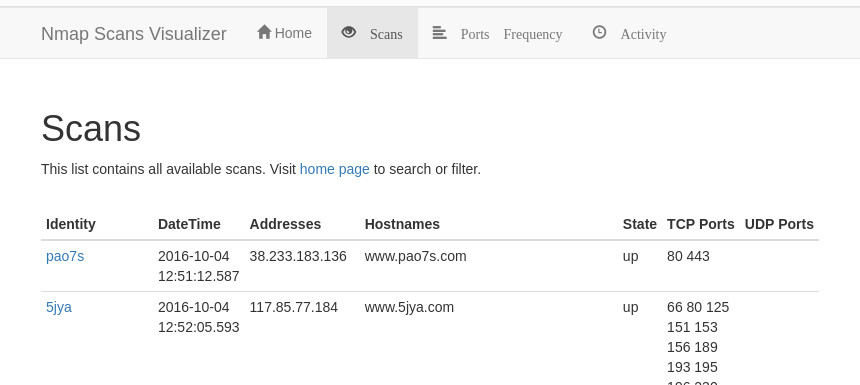

# Nmap Scans Visualizer

NSV is a simple demo web application for displaying Nmap scan data.  It consists of three main
components:

- An [ElasticSearch](https://www.elastic.co/elasticsearch) server were the data is stored and
  queried
- A [Flask](https://flask.palletsprojects.com/en/stable/) backend server that communicates
  with the Elasticsearch server and exposes API services to the web
- A frontend where [AngularJS](https://angularjs.org/) is used as a runtime code generator

## Requirements for runtime

When running this application using Docker images that were uploaded in [Docker
Hub](https://hub.docker.com/u/rppedraza), only [Docker](https://docs.docker.com/engine/install/)
will be needed to be installed in the system.

However if the images are going to be built from source, or if the application is going to be run
in development mode, the following tools will also be needed:

- [Task](https://taskfile.dev/installation/)
- [PNPM](https://pnpm.io/installation)
- [Python](https://www.python.org/)
- [Requests](https://pypi.org/project/requests/)

## Cloning the repo

    git clone https://github.com/rp-pedraza/nsv.git
    cd nsv

## Development and production modes

The frontend service is provided by [connect](https://www.npmjs.com/package/connect) while in
development mode, and the backend service is provided by
[Flask](https://flask.palletsprojects.com/en/stable/).

The Elasticsearch server can be run as a Docker service.  This can be done trough the `task es:up`
command.  Or it be can be setup manually somewhere.  It simply needs to listen on port `9200`.

In production mode, the frontend files are statically compiled and are served through Nginx. The
backend is still run by Flask but now works under
[uWSGI](https://uwsgi-docs.readthedocs.io/en/latest/) and [Nginx](https://nginx.org/en/).  All
these services and tasks run through Docker.

## Running the application in development mode

Make sure all the necesary software are installed and run the following command in a terminal:

    task backend:all

This will instantiate an Elasticsearch server, import data to it, and then run the backend server.

If the Elasticsearch server is set up to run externally, run the `task data:import backend:server`
command instead so only the data importer and the backend server runs.

Run the following command in another terminal as well to start the frontend server:

    task frontend:serve

A browser page should automatically open up to http://localhost:9000 if everything runs correctly.

## Running the application in production mode through `docker compose`

In this mode, all services are run through Docker.  They can be instantiated using the following
command:

    task docker:up

This will build the services and its images first if they don't yet exist.  `docker:up:build` will
force the images to be rebuilt again.

## Running the application using the images from Docker Hub

To use images from Docker Hub, run the following:

    task docker:pull:up

Or without using `task`:

    ( cd docker && docker compose pull && docker compose up --no-build )

Open the browser page to http://localhost:80/ to visit the application.

## WSL2

The uploaded Docker images have been tested to work in Ubuntu 22.04 running in WSL2 mode as well.
See [this page](https://docs.docker.com/desktop/features/wsl/) for instructions on how to have a
properly integrated Docker setup.
